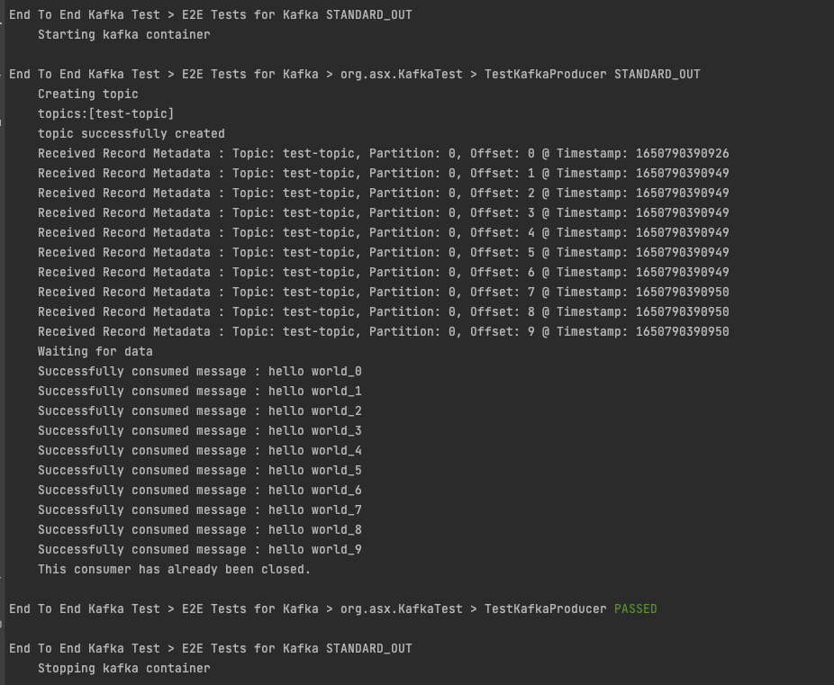
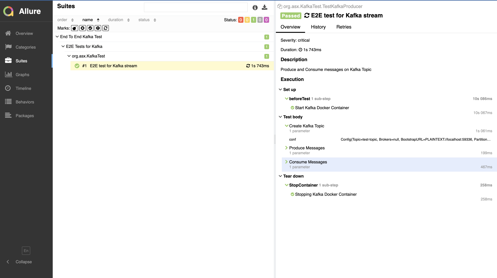

# Kafka Test Container Implementation

This repo contains a code to create 
- New Kafka Topic
- Produce Messages to the topic
- Consume messages from the topic

Test Container helps to test code by running kafka locally using docker container. 

## How to execute tests
```shell script
gradle clean
gradle build
gradle task E2E
gradle allureReport
gradle allureServe
```

## Execution Console Output


## Allure Report

